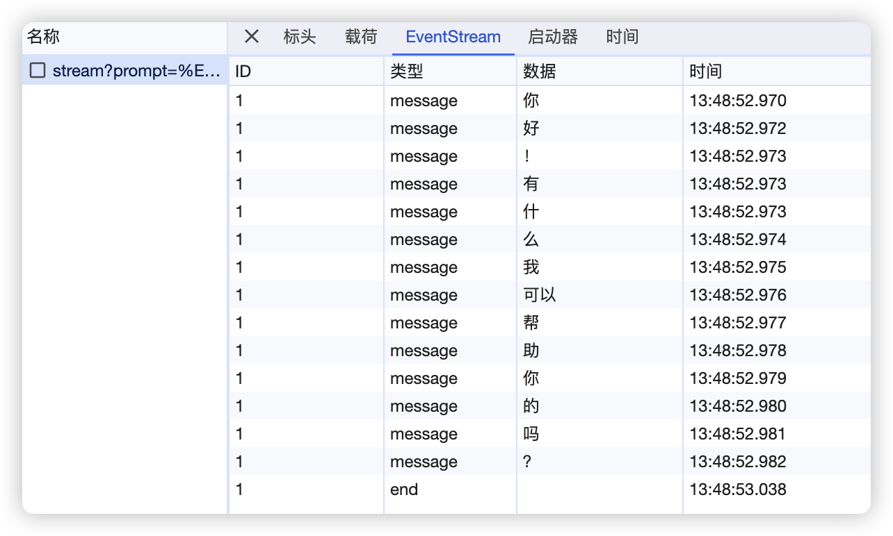

[Server-Sent Events](https://zh.javascript.info/server-sent-events) 是一种基于 HTTP 长连接的服务端推流服务，服务端和客户端建立连接之后，服务端可主动向客户端推送数据流，而无需客户端再次发起请求。

服务端通过设置 HTTP 返回数据媒体类型 `"Content-Type": "text/event-stream; charset=utf-8"` 来开启 SSE，并设置 `"Cache-Control": "no-cache"` 来避免客户端缓存数据流。

`EventSource` 是浏览器用于接收 SSE 数据流的 JS API。使用方式如下：

```ts
const sse = (url: string, init?: EventSourceInit) => {
  const es = new EventSource(url, init);
  // sse 开启
  es.onopen = event => {};
  // message 事件监听
  es.onmessage = event => {};
  // 异常捕获
  es.onerror = event => {};
  // 自定义事件 end 监听
  es.addEventListener("end", event => {
    es.close();
  });
};
```

通过 Chrome Dev tools 查看接口信息。

注意，只有通过浏览器原生 `EventSource` 建立的 SSE 连接，类型才是 `eventsource`，也只有在这种情况，浏览器调试面板 EventStream 这栏才能看到数据流信息。

在这个面板里，我们可以看到有两种数据类型，其中 `message` 类型是原生支持的，因此可以使用 `onmessage` 监听，但是 `end` 事件并不是 `EventSource` 原生支持的，因此需要使用 `addEventListener` 监听。

SSE 接口具体返回什么事件类型什么数据都是服务端控制的，下面是一段 python 实现的 SSE 代码片段：

```python
@chat_router.get("/stream")
async def event_stream(prompt: str):
	headers = {
		"Content-Type": "text/event-stream; charset=utf-8",
		"Cache-Control": "no-cache",
	}

	def completion():
		stream = ["你","好","!","有","什","么","我","可以","帮","助","你","的","吗","？"]
		for chunk in stream:
			yield f"event: message\ndata: {chunk}\nid: 1\n\n"
		yield "event: end\ndata: \nid: 1\n\n"

	return StreamingResponse(completion(), headers=headers)
```

尽管浏览器的 `EventSource` 可以满足我们平时大部分需求，但是它也有解决不了的问题，比如：

1. 只支持 `GET` 请求。
2. 不支持自定义 `headers`。

因此社区通过 `fetch` 实现了 SSE，你可以通过 `fetch` 方法获取服务端推送的数据流。但遗憾的是当使用 `fetch` 代替 `eventsource` 连接 SSE 时，你在 Dev tools EventStream 里再也看不到数据流信息了，那里变成了一片空白。

使用 fetch 连接 SSE 示例：

```ts
const sse = async (url: string, data: Record<string, any>) => {
  const response = await fetch(url, {
    body: JSON.stringify(data),
    method: "POST",
    headers: {
      "Content-Type": "application/json",
      Accept: "text/event-stream",
    },
  });
  return response.body;
};
```

如果要处理服务端之间的流式数据传输，可以使用 `application/x-ndjson` 或 `application/stream+json` 媒体类型，参考：[What's the difference between "text/event-stream" and "application/stream+json"](https://stackoverflow.com/questions/52098863/whats-the-difference-between-text-event-stream-and-application-streamjson)

最后推荐几个比较好用的 SSE `npm` 包：

[@microsoft/fetch-event-source](https://github.com/Azure/fetch-event-source)：`fetch` 实现的增强版 `EventSource`，仅在浏览器环境运行。

[eventsource](https://github.com/EventSource/eventsource)：`fetch` 实现的 `EventSource`，可在 Node 环境执行，也可作为原生 `EventSource` 的 `polyfill`。

[eventsource-parser](https://github.com/rexxars/eventsource-parser)：数据流解析工具包。

[ai](https://github.com/vercel/ai)：构建流式文本响应和聊天 UI 的库，如果你正在使用 Next.js 开发 ChatGPT 应用那就直接选这个。
